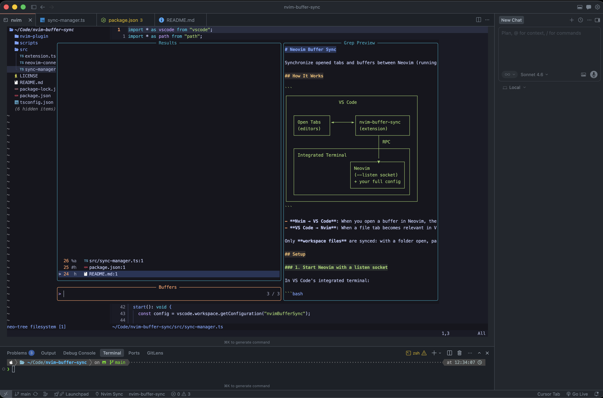

## Neovim Buffer Sync

Synchronize opened tabs and buffers between Neovim (running in VS Code's integrated terminal) and VS Code. Use your full Neovim configuration while keeping files visible to Cascade and agentic AI flows.

✅ Linux  
✅ macOS  
❌ Windows (not supported)



## How It Works

```
┌──────────────────────────────────────────────────┐
│                    VS Code                       │
│                                                  │
│  ┌─────────────┐         ┌────────────────────┐  │
│  │ Open Tabs   │◄───────►│ nvim-buffer-sync   │  │
│  │ (editors)   │         │ (extension)        │  │
│  └─────────────┘         └────────┬───────────┘  │
│                                   │ RPC          │
│  ┌────────────────────────────────┼───────────┐  │
│  │ Integrated Terminal            │           │  │
│  │                     ┌──────────▼─────────┐ │  │
│  │                     │ Neovim             │ │  │
│  │                     │ (--listen socket)  │ │  │
│  │                     │ + your full config │ │  │
│  │                     └────────────────────┘ │  │
│  └────────────────────────────────────────────┘  │
└──────────────────────────────────────────────────┘
```

- **Nvim → VS Code**: When you open a buffer in Neovim, the file opens in VS Code according to **`nvimBufferSync.openBehavior`** (default **`background`**: **persistent** tab, focus stays in the terminal; **`preview`** uses a single replaceable preview tab; **`active`** focuses the editor).
- **VS Code → Nvim**: When a file tab becomes relevant in VS Code (see below), it is added to Neovim’s buffer list with `:badd` over RPC.

Only **workspace files** are synced: with a folder open, paths must lie under a workspace root. **`ignoredPatterns`** are matched as substrings on normalized file paths and apply to **both** directions.

## Setup

### 1. Start Neovim with a listen socket

In VS Code's integrated terminal:

```bash
nvim --listen /tmp/nvim-vscode.sock
```

Or set it in your shell config so it's automatic:

```bash
# .zshrc / .bashrc
alias vnvim='nvim --listen /tmp/nvim-vscode.sock'
```

### 2. Install the VS Code extension

```bash
git clone https://github.com/KarolFrankiewicz/neovim-buffer-sync.git
cd neovim-buffer-sync
npm install
npm run compile
```

Use `npm run watch` for incremental rebuilds with source maps while developing. The build bundles extension code with esbuild into a single minified `out/extension.js`, so the packaged VSIX does not include `node_modules`. The official `neovim` client pulls in **winston** only for optional file/console logging; the bundle aliases it to a tiny no-op shim so the VSIX stays small (the upstream `NVIM_NODE_LOG_FILE` / `ALLOW_CONSOLE` hooks from that logger are not active in the packaged extension).

Then press `F5` in VS Code to launch the extension in development mode, or package it:

```bash
npx @vscode/vsce package
code --install-extension nvim-buffer-sync-0.1.0.vsix
```

### 3. (Optional) Install the Neovim plugin

The extension injects autocommands via RPC when it connects, so a Neovim plugin is **not strictly required**. However, you can install the bundled plugin for additional commands and to ensure events fire even before the extension connects.

With [lazy.nvim](https://github.com/folke/lazy.nvim):

```lua
{
  "KarolFrankiewicz/neovim-buffer-sync",
  config = function()
    -- Point to the nvim-plugin subdirectory
    vim.opt.runtimepath:append(
      vim.fn.stdpath("data") .. "/lazy/neovim-buffer-sync/nvim-plugin"
    )
    require("vscode-sync").setup()
  end,
}
```

Or with a local clone:

```lua
{
  dir = "<YOUR_NEOVIM_BUFFER_SYNC_PATH>/nvim-plugin",
  config = function()
    require("vscode-sync").setup()
  end,
}
```

Or symlink into your Neovim plugin path:

```bash
ln -s <YOUR_NEOVIM_BUFFER_SYNC_PATH>/nvim-plugin ~/.local/share/nvim/site/pack/vscode/start/vscode-sync
```

## Extension Settings

| Setting | Default | Description |
|---|---|---|
| `nvimBufferSync.socketPath` | `""` | Neovim socket path. Empty = **auto-discover** known locations (e.g. `/tmp/nvim-vscode.sock`, `NVIM_LISTEN_ADDRESS`, `/tmp/nvim…/0`). |
| `nvimBufferSync.autoConnect` | `true` | On startup, retry connecting on an interval, and **retry once** when a **new integrated terminal** opens (still uses socket discovery, not shell inspection). |
| `nvimBufferSync.syncVscodeToNvim` | `true` | Sync VS Code file opens to Neovim buffers. |
| `nvimBufferSync.syncNvimToVscode` | `true` | Sync Neovim buffer opens to VS Code tabs. |
| `nvimBufferSync.openBehavior` | `"background"` | `background`: persistent tab, terminal keeps focus. `preview`: one preview tab (next open can replace it). `active`: persistent tab, editor focused. |
| `nvimBufferSync.ignoredPatterns` | `["term://", ...]` | Substrings; if a path contains one, it is skipped for sync **both ways**. |
| `nvimBufferSync.syncDiffAndReviewTabs` | `true` | Sync **diff / review** tabs: underlying `file:` paths go to Neovim (`badd`). |
| `nvimBufferSync.closePreviewBuffersInNvim` | `true` | When **`openBehavior`** is **`preview`**: replacing the VS Code preview tab can remove the **previous** file’s Neovim buffer if safe. Does **not** disable removal when you **close the last VS Code tab** for a file opened from VS Code (that cleanup is still attempted when safe). |

### Review / diff tabs in Neovim

VS Code/Cursor **review** and **diff** views are usually a `TabInputTextDiff` (original + modified URIs). Neovim cannot render that UI, but any side that is a real `file:` path on disk is added to Neovim’s buffer list (`:ls`, `:b`). You edit the **working copy** like a normal buffer.

Turn off with `nvimBufferSync.syncDiffAndReviewTabs` if you only want plain file tabs synced.

## Commands

- **Neovim Buffer Sync: Connect to Neovim** — Quick-pick a discovered socket or enter a path, then connect.
- **Neovim Buffer Sync: Disconnect from Neovim** — Close the RPC session (Neovim keeps running).
- **Neovim Buffer Sync: Show Connection Status** — Modal with socket, Neovim buffer count, VS Code tab count; actions to disconnect or refresh.

## Neovim Plugin Commands

If you installed the optional Neovim plugin:

- `:VSCodeSyncList` — Sends `nvim_buf_sync_list` over RPC. The extension **does not yet** apply that batch list to VS Code tabs (notification is received only). Sync still follows live `BufAdd` / `BufReadPost` events and initial sync on connect.
- `:VSCodeSyncStatus` — Print tracked buffers in Neovim (local; does not talk to VS Code).

## Architecture

The extension uses Neovim's built-in **msgpack-RPC** protocol (the same one used by Neovim GUIs). When connected:

1. It runs a **Lua snippet over RPC** (`nvim_exec_lua` under the hood) that registers `BufAdd` / `BufReadPost` / `BufDelete` autocommands in that Neovim instance.
2. Those autocommands call `rpcnotify(0, "nvim_buf_sync_open" | "nvim_buf_sync_close", …)` so the Node client receives notifications.
3. The extension opens, closes, or skips VS Code editors/tabs based on those events and on settings (`openBehavior`, workspace filter, etc.).
4. In the other direction it reacts to **`vscode.window.tabGroups.onDidChangeTabs`** (opened/closed tabs) and **`vscode.window.onDidChangeVisibleTextEditors`**, then issues `:badd` over RPC (not `onDidOpenTextDocument`).

**Echo suppression**: `syncedFromNvim` / `syncedFromVscode` plus a short post-mirror window and in-flight deduping prevent the same file from bouncing between Neovim and VS Code when multiple UI events fire for one user action.

## Tips

- Set `nvimBufferSync.openBehavior` to `"background"` (default) for persistent editor tabs without stealing focus from the terminal; use `"preview"` if you prefer a single preview slot.
- After **disconnect** (e.g. Neovim exited), the extension schedules reconnect attempts and keeps retrying on the **autoConnect** interval.
- With **no workspace folder** open, the “must be under a workspace root” rule is skipped; sync still requires an existing file path and respects `ignoredPatterns`.
- For the best experience, configure your Neovim `--listen` socket path as a fixed value (e.g., `/tmp/nvim-vscode.sock`) and set it in `nvimBufferSync.socketPath`.
